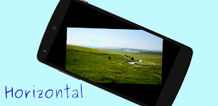

# Steady Viewer

Using accelerometer, this app calculates the inclination of your smartphone. Depending on the result, it smoothly rotates the image. This rotation cancels the inclination of the smartphone.

So, you can see the image horizontally.

Most image viewer can rotate images by 0, 90, 180, 270 degree which is extremely discrete.
This app can rotate images continuously.

You can also move and zoom images by a simple gesture.

# Platform
Android

# Screenshot

